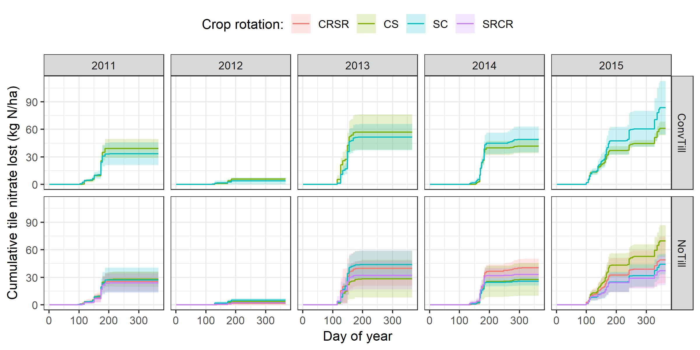

# drainData4APSIM
An example of how to compute annual tile nitrate loss from drain experiments and create APSIM-readable files 

I made this repo using data I downloaded from the [Sustainable Corn CAP research dataset](https://datateam.agron.iastate.edu/cscap/dl/). It calculates daily fluxes on nitrate-nitrogen in tile drainage from these data (see example below). The at the end, it saves the data as a ".out" texfile that can be read into the APSIM UI.  Let me know if you have any questions. 

